# BriefCASE Tutorial

---

## Page 1

### BriefCASE Tutorial

seL4 Summit

October 13, 2022

1 Overview
This tutorial illustrates an end-to-end application of the BriefCASE cyber-resiliency tools and workflow.
The goal is to show how the tools are used and provide a starting point for experimentation and
evaluation of the tool capabilities.

BriefCASE was developed on the DARPA CASE program, and is comprised of design, analysis, and
verification tools that enable system engineers to design-in cyber-resiliency for complex cyber-physical
systems. Cyber-resiliency means that the system is tolerant to cyber-attacks just as safety-critical
systems are tolerant to random faults: they recover and continue to execute their mission function, or
safely shut down, as requirements dictate.

The BriefCASE tools are built around three technology pillars:

1. Model-based systems engineering for cybersecurity.  BriefCASE is an integrated development

environment that makes the security guarantees of the seL4 verified microkernel accessible to
system developers.  Secure systems can be built directly from detailed, verified models in the
Architecture Analysis and Design Language (AADL).  Our tools provide the ability to target different
execution platforms to facilitate incremental debugging and development (JVM, Linux, seL4 on
QEMU emulator, and native seL4).  We also provide techniques to deal with legacy code (the “cyber
retrofit” technique, which uses a guest OS running in a VM on seL4).
2. Cyber-resilience developer support tools.  These tools assist systems engineers in mitigating cyber

threats.  Our tools provide automated architecture transforms and high assurance components
generated from formal specifications (with proof of correctness).   Our tools also generate evidence
in the form of a Resolute assurance case demonstrating how and why requirements have been
satisfied.
3. Integration of formal verification and proof.  Our tools integrate proof evidence generated

throughout the development process to provide end-to-end assurance of cybersecurity properties.
This includes formal verification of functional and cyber-resiliency properties, high-assurance
component proofs, evidence that code generated from AADL models preserves information flow
properties. These proofs build on the security guarantees provided by the seL4 proof.

This document will step through the BriefCASE workflow, starting with an initial AADL model for a UAV
surveillance application.  Next, we will import cyber requirements and transform the model to mitigate
the vulnerabilities corresponding to those requirements.  The AGREE and Resolute tools can be run on
the transformed system to demonstrate that the requirements have been satisfied in the model.  We
will then generate code from the hardened model, build for an seL4 target, and run the final system in
the QEMU emulator.  A more detailed description of the BriefCASE tool capabilities is found in the User
Guide.

1

---

## Page 2

2 Tutorial Setup
The BriefCASE environment is packaged in virtual machine and requires VirtualBox v6.1.8 or above to
run.  The VirtualBox .ova (~ 7GB) can be downloaded here:

https://ca-trustedsystems-dev-us-east-1.s3.amazonaws.com/CASE/case-tutorial.ova.gpg

The file can be decrypted using a GnuPG decryption tool such as Gnupg4win.  The decryption key is
provided by the instructor.

Import the .ova in VirtualBox and start the VM.  The Debian guest OS login username and password are
both ‘vagrant’.

Once the Debian guest OS has booted, open a terminal and launch BriefCASE by entering

briefcase&

Snapshots of the example project are provided for each step of the tutorial.  The projects are version-
controlled, making it possible to discard any changes that were made erroneously.  To revert back to the
original version of a project file, right-click the file in the AADL Navigator pane and select Replace with
→ HEAD revision.  Click the Discard Changes button in the dialog box.

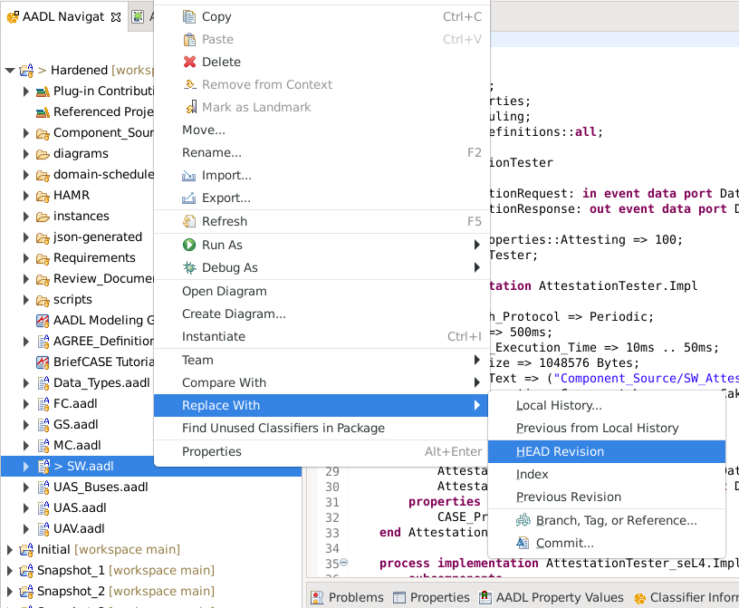

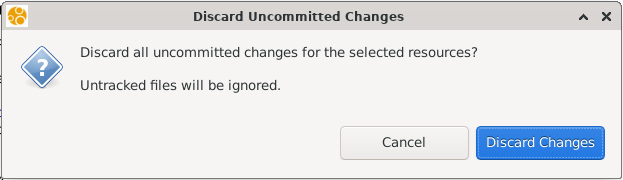

3 Initial Model

CHECKPOINT 0 – The Initial project corresponds to this section of the tutorial.

The example includes an initial architecture model, as well as basic implementation code for the non-
hardened components.  External inputs and outputs have been eliminated so that the hardened system
can be generated and executed on QEMU.

2

---

## Page 3

We start with a basic UAV flight planning application, which will run in the UAV Mission Computer.  The
Mission Computer architecture model is specified in the MC.aadl file.  The initial flight planning
application software is specified in the SW.aadl file, and consists of three software components:

•
RadioDriver periodically produces MissionCommand messages consisting of a node ID and two
waypoints (initial and final coordinates) describing a desired flight plan.  Some messages will
contain a bad ID (to test attestation) and some messages will contain a malformed waypoint (to
test filtering).
•
FlightPlanner receives MissionCommand messages from the Radio, inserts a new waypoint
midway between the initial and final points, and produces the resulting FlightPlan message.
Some messages will contain a bad middle waypoint to test monitoring.  For this example, we
assume the FlightPlanner is third-party software, and could therefore contain unverified or even
malicious code.
•
FlightController prints the received FlightPlan messages to the console and is also able to
display alerts generated by a monitor.

Graphical representations of the UAV Mission Computer and software models can be found in
/diagrams/UAV_UAV_Impl_initial.aadl_diagram and /diagrams/SW_SW_Impl.aadl_diagram,
respectively.  The initial software model is shown in Figure 1.  In the figure, the FlightPlanner is colored
red to indicate it is untrusted.

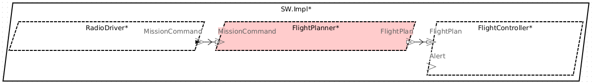

Figure 1. Initial AADL model.

OSATE supports both a textual and graphical editor.  Most BriefCASE features presented in this tutorial
will be demonstrated using the graphical editor, although both editors are generally supported.

The OSATE graphical editor has come a long way in the last few years, but there
are still a few issues with refreshing the model that you will notice.  The following
keyboard shortcuts come in handy when viewing the graphical model:

Ctrl-A
Select all elements
Ctrl-Shift-D
Show the default elements of the selected component(s)
Ctrl-Shift-L
Layout elements in the diagram

4 Cyber Requirements
For this tutorial, it is assumed that a cyber-requirements tool such as GearCASE was recently run on the
Mission Computer implementation (MC::MissionComputer.Impl), and that its output
(GearCASE_Cyber_Requirements.json) was placed in the project’s
/Requirements/GearCASE/requirements/ folder.

3

---

## Page 4

4.1 Importing Requirements
To import the generated requirements into the model so they can be addressed, open the MC.aadl file,
select MissionComputer.Impl in the outline pane and choose BriefCASE → Cyber Requirements →
Import Requirements… from the main menu, as shown in Figure 2.

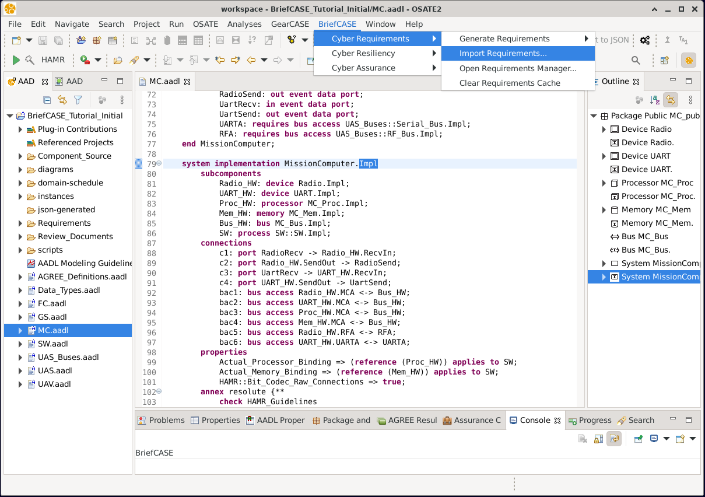

Figure 2. Import generated requirements.

A file selection dialog will open.  Navigate to the /Requirements/GearCASE/requirements directory,
select the GearCASE_Cyber_Requirements.json file, and click Open.  The Requirements Manager will
open, displaying a list of generated requirements (see Figure 3).

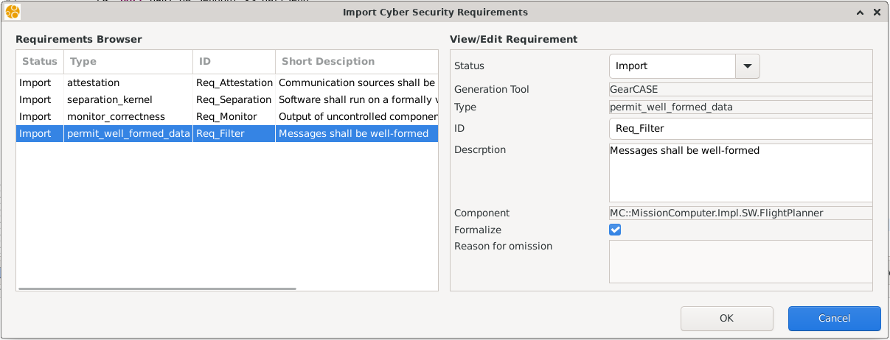

Figure 3. BriefCASE Requirements Import Manager.

For this example, four requirements were generated.  For each requirement, set the Status and ID fields
as shown in the figure.  For the permit_well_formed_data requirement, check the Formalize checkbox.

4

---

## Page 5

Click OK, and the requirements will then be imported into the model as Resolute goals, which can be
found in the /Requirements/CASE_Requirements.aadl file.

Because the Req_Filter requirement was set as formalized, an AGREE assume statement was
automatically generated for the FlightPlanner.  By default, the formal expression is set to false, which
will cause AGREE to fail if it is run.  In SW.aadl, modify the expression on line 70 as shown below, which
completes the formalization of the requirement:

assume Req_Filter "Messages shall be well-formed" :

event(MissionCommand) => WELL_FORMED_MISSION_COMMAND(MissionCommand);

4.2 Requirements as Resolute Goals
The requirements are maintained as goals in a Resolute assurance case.  Initially, the goals do not
specify strategies or evidence to support the goals, so running Resolute at this time will generate a
failing assurance case, as expected.  To verify this, open MC.aadl in the editor, select
MissionComputer.Impl in the Outline pane and choose BriefCASE → Cyber Assurance → Run Resolute
from the menu.  The failing assurance case will appear with red exclamation marks in the Assurance
Case pane at the bottom of the IDE, as shown in Figure 4.

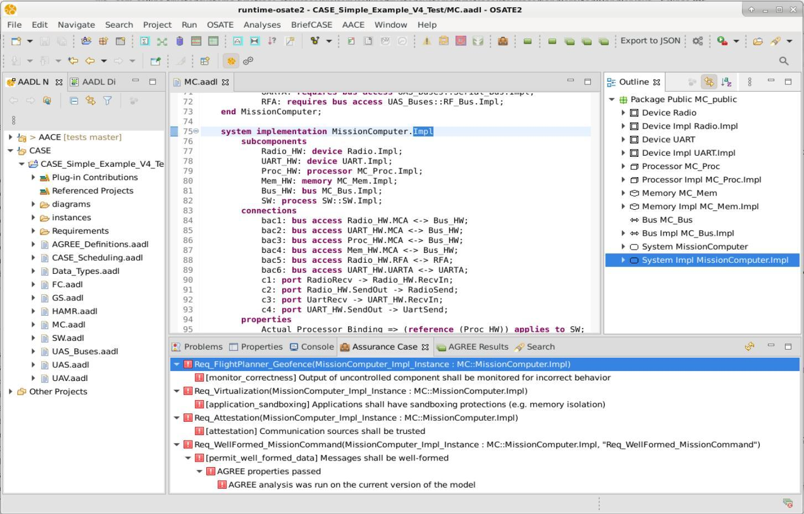

Figure 4. Resolute results.

5 Cyber-Resiliency Transforms
In this section we show how to use the automated cyber-resiliency transforms included with the
BriefCASE tool.  These transforms will address the cyber-requirements that were imported into the

5

---

## Page 6

model.  The BriefCASE User’s Guide contains additional information on how to perform each
transformation and refers to micro-examples included with the CASE virtual machine in the
~/CASE/transform-examples directory of the VM.

5.1 seL4 Transform

CHECKPOINT 1 – The Snapshot_1 project corresponds to this section of the tutorial.

The Req_Separation requirement can be addressed by running the Mission Computer surveillance
application on an seL4 target.  Since seL4 provides both memory (spatial) and execution (temporal)
separation guarantees, the proper way to represent this in AADL is to have each thread run in its own
dedicated process.  When using BriefCASE, the model can be transformed to an seL4 representation
anytime during development.  After the seL4 transformation has been performed, successive BriefCASE
transformations give the user the option to generate seL4-formatted components.

To perform the seL4 transform, open the MC.aadl file in the editor, select the SW process
subcomponent from the Outline pane (or on line 87 in the text editor, within the MissionComputer
implementation), and choose BriefCASE → Cyber Resiliency → Model Transformations → Transform for
seL4 Build… from the menu.  A dialog will appear for selecting the requirement that is driving this
transform.  Choose the Req_Separation requirement from the drop-down list and click OK.

Once the transform has completed, a notification will appear in the lower right-hand corner of the
screen, and both the MC.aadl and SW.aadl files will have been modified.  The most obvious changes will
be in the SW.aadl file where, for each thread, a process is created containing that thread as a
subcomponent.  The SW component is also transformed from a process to a system.

The transform also updated the Req_Separation requirement in the
/Requirements/CASE_Requirements.aadl file, as can be seen in Figure 5.

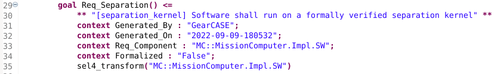

Figure 5. Updated seL4 requirement.

Because the requirement is being addressed by adding the necessary build properties and modifying the
architecture representation, a new rule is added to the Resolute goal that specifies the evidence
required to show the goal has been satisfied.  Running Resolute at this time will result in a passing claim.

6

---

## Page 7

5.2 Attestation Transform

CHECKPOINT 2 – The Snapshot_2 project corresponds to this section of the tutorial.

The Req_Attestation requirement can be mitigated by performing the Attestation transform.  Open the
software process model (/diagrams/SW_SW_seL4_Impl.aadl_diagram) in the graphical editor.  Select
the RadioDriver process subcomponent within the SW system implementation and choose BriefCASE →
Cyber Resiliency → Model Transformations → Add Attestation… from the menu.  A wizard will open, as
shown in  Figure 6.

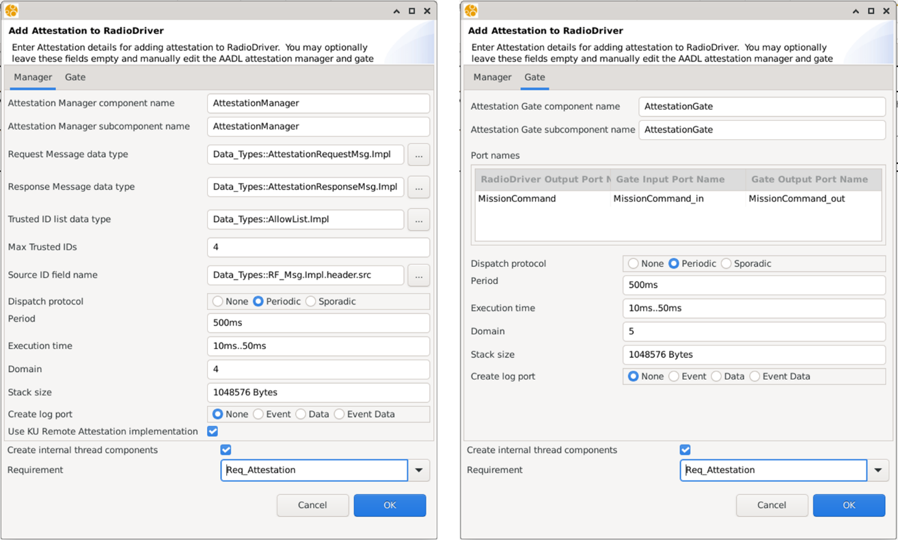

Figure 6. Attestation Transform wizard.

Note that the wizard contains two tabs, one for configuring the Attestation Manager, and the other for
configuring the Attestation Gate.  Fill in the fields on each tab as shown in the figure, then click OK.
Attestation components will be inserted into the model, as shown in green in Figure 7.

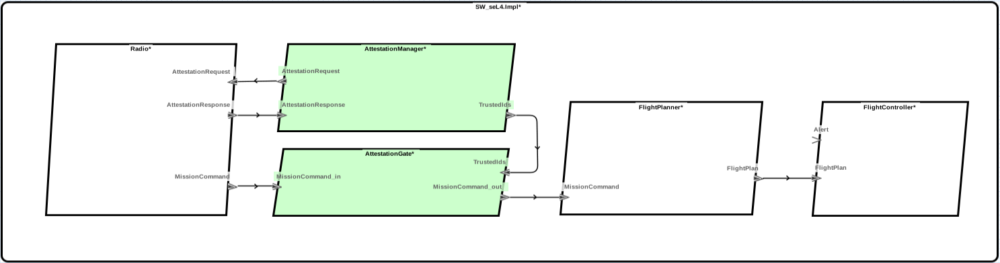

Figure 7. Attestation components inserted into model.

7

---

## Page 8

Because the University of Kansas (KU) implementation option was selected in the configuration wizard,
the Attestation Manager implementation CakeML source code is compiled and added to the project
directory, as shown in Figure 8.

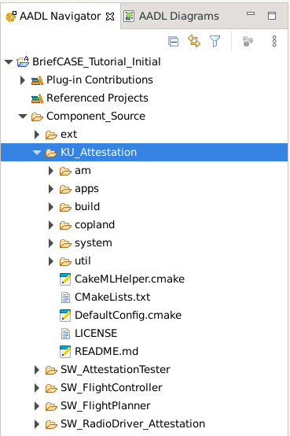

Figure 8. KU remote attestation implementation directory.

The transform also updated the Req_Attestation requirement in the
/Requirements/CASE_Requirements.aadl file, as can be seen in Figure 9.

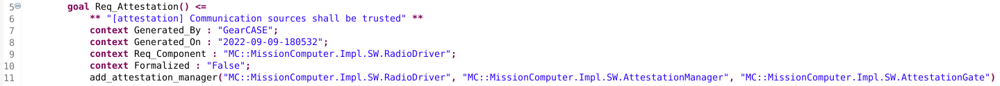

Figure 9. Updated attestation requirement.

Because the requirement is being addressed by adding attestation components, a new rule is added to
the Resolute goal that specifies the evidence required to show the goal has been satisfied.

The attestation gate implementation is synthesized by SPLAT, which will be described later in the
tutorial.

8

---

## Page 9

5.3 Filter Transform

CHECKPOINT 3 – The Snapshot_3 project corresponds to this section of the tutorial.

To ensure messages received by the FlightPlanner are well-formed, a Filter can be inserted immediately
before the FlightPlanner on connection c1, thereby addressing the Req_Filter requirement.  To insert the
Filter, select port connection c1 within the SW system implementation in either the text or graphical
editor or the corresponding Outline pane, and choose BriefCASE → Cyber Resiliency → Model
Transformations → Add Filter… from the menu.  A configuration wizard will open, as shown in Figure 10.

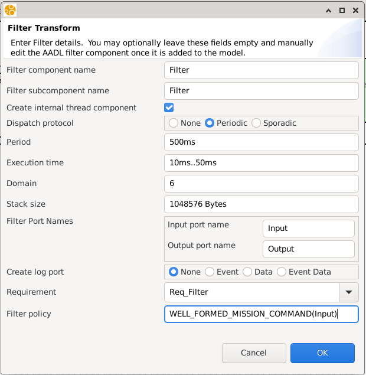

Figure 10. Filter Transform wizard.

Fill in the fields as shown in the figure, then click OK.  For the Filter policy, enter:

WELL_FORMED_MISSION_COMMAND(Input)

The details of this policy can be found in the AGREE_Definitions.aadl file.  It specifies that all the
waypoints must have valid latitude and longitude values.

A Filter component will be inserted into the model, as shown in green in Figure 11.

9

---

## Page 10

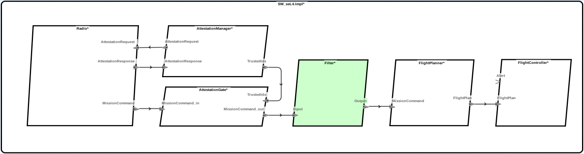

Figure 11. Filter component inserted into model.

The transform also updates the Req_Filter requirement in the /Requirements/CASE_Requirements.aadl
file, as can be seen in Figure 12.

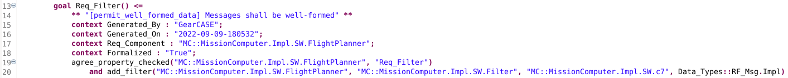

Figure 12. Updated filter requirement.

Two clauses in the Resolute goal check that (1) AGREE was run on the current version of the model (and
passed), since this requirement is formalized, and (2) that the Filter was inserted properly in the model
and the implementation is correct.

The Filter implementation is synthesized by SPLAT, which will be described later in this tutorial.

5.4 Monitor Transform

CHECKPOINT 4 – The Snapshot_4 project corresponds to this section of the tutorial.

Because the FlightPlanner component is considered untrusted, the Req_Monitor requirement was
generated to protect against suspicious behavior.  To insert a Monitor, select connection c2 within the
SW system implementation either in the editor or the Outline pane, and choose BriefCASE → Cyber
Resiliency → Model Transformations → Add Monitor… from the menu.  A configuration wizard will
open, as shown in Figure 13.

10

---

## Page 11

Figure 13. Monitor Transform wizard.

Note that the wizard contains two tabs.  Fill in the fields on each tab as shown in the figure, then click
OK.  For the Monitor Policy, enter:

WAYPOINTS_IN_ZONE(Observed, keep_in_zone)

The details of this policy are specified in the AGREE_Definitions.aadl file.  It checks that all the waypoints
lie within a pre-defined rectangular keep-in zone.

A Monitor component will be inserted into the model, as shown in green in Figure 14.

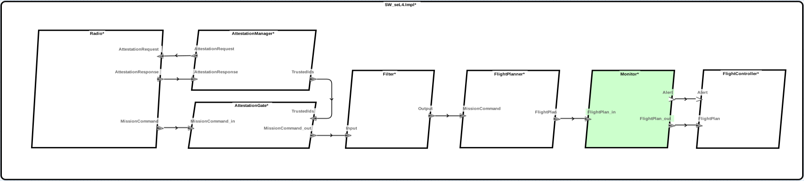

Figure 14. Monitor component inserted into model.

The transform also updated the Req_Monitor requirement in the
/Requirements/CASE_Requirements.aadl file, as can be seen in Figure 15.

11

---

## Page 12

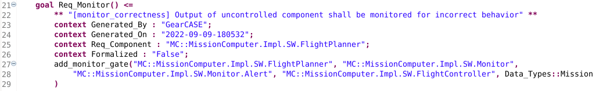

Figure 15. Updated monitor requirement.

The Monitor implementation is synthesized by SPLAT, which will be described next.

6 High-Assurance Component Synthesis

CHECKPOINT 5 – The Snapshot_5 project corresponds to this section of the tutorial.

High-assurance components that have their behavior specified in AGREE can be synthesized using the
SPLAT tool.  To run SPLAT on the SW implementation, open the SW.aadl in the text editor, select the
SW_seL4.Impl implementation, and select BriefCASE → Cyber Resiliency → Synthesis Tools → Run
SPLAT from the main menu, as shown in Figure 16.

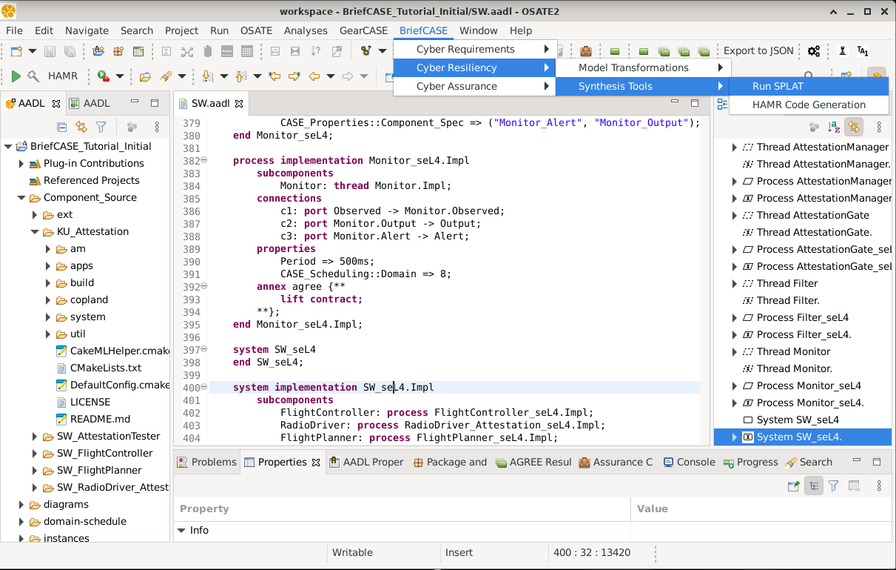

Figure 16. Running SPLAT.

As SPLAT runs, status messages will appear in the console at the bottom of the IDE, and a notification
will be displayed in the lower right-hand corner when it completes.  A maximized view of the console is
shown in Figure 17.

12

---

## Page 13

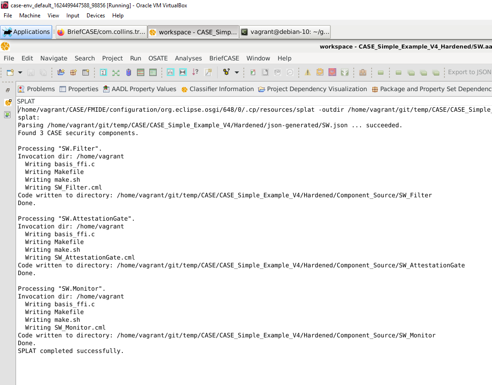

Figure 17. SPLAT console.

SPLAT outputs compiled CakeML component implementations to the Component_Source folder, with
each component implementation in a separate folder.  In addition, the Source_Text property of each
high-assurance thread implementation will be set to the location of the corresponding source file in the
project directory.

7 Analyze System for New Cyber Vulnerabilities

CHECKPOINT 6 – The Snapshot_6 project corresponds to this section of the tutorial.

Now that we’ve hardened the Mission Computer design by transforming the model, we want to make
sure no new vulnerabilities were introduced in the process.  Open the MC.aadl file, select
MissionComputer.Impl in the Outline pane and choose BriefCASE → Cyber Requirements →Generate
Requirements → GearCASE from the menu.

When GearCASE completes, ensure MissionComputer.Impl is still selected, and choose BriefCASE →
Cyber Requirements → Import Requirements… from the menu.  A file selection dialog will open (see
Figure 18).

13

---

## Page 14

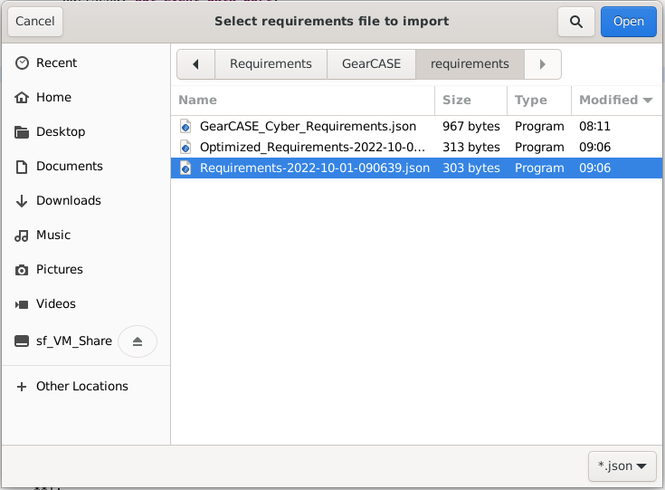

Figure 18. File selection dialog for importing new requirements.

Navigate to the /Requirements/GearCASE/requirements directory, select either of the most recently
modified files (Requirements-2022… or Optimized_Requirements-2022…) and click Open.  The
Requirements Manager will then open, displaying both the imported requirements generated earlier,
and any new requirements (of which there are none).

Click OK.  Cyber analysis has not found any new vulnerabilities.  The system design is acceptably cyber
resilient.

8 Analysis of the Cyber-Resilient System

CHECKPOINT 7 – The Snapshot_7 project corresponds to this section of the tutorial.

Now that we have transformed the system to address the cyber-requirements, we can analyze the
resulting model using AGREE (formal verification of behaviors) and Resolute (generation and checking of
an assurance case).

8.1 Formal Verification using AGREE
Although formal verification of the model is not the focus of this tutorial, AGREE can still be run on the
model to verify that it satisfies its contracts.  To run AGREE, select the SW_seL4.Impl system
implementation in the text or graphical editor or corresponding Outline pane, then choose BriefCASE →
Cyber Assurance → AGREE → Verify Single Layer from the menu.  The results will display in the AGREE
results pane, and should pass, as indicated by green checkmarks (see Figure 19).

14

---

## Page 15

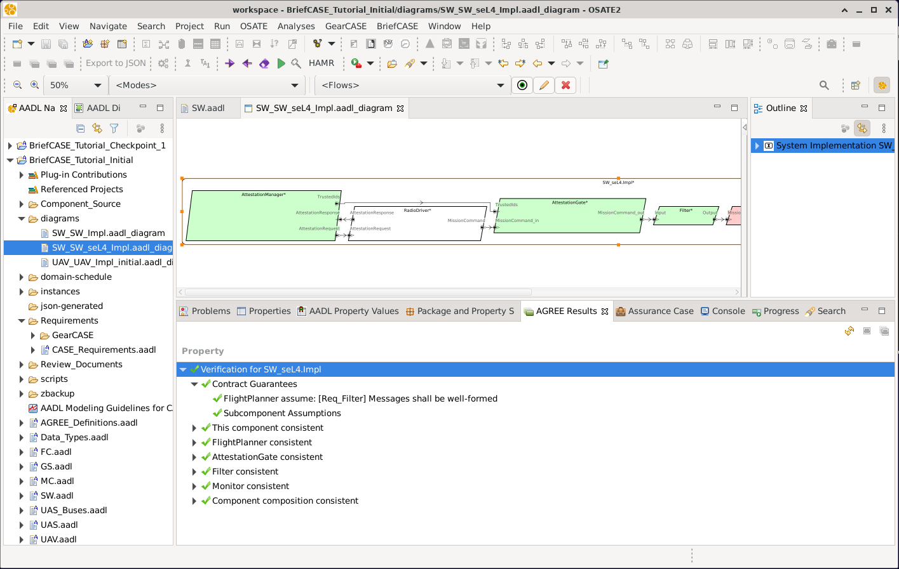

Figure 19. AGREE formal verification results.

8.2 Cyber Assurance Case
Now that all requirements have been addressed, the high-assurance components have been
synthesized, and formal verification was performed, Resolute should produce a passing assurance case.
To confirm this, select the MissionComputer implementation in MC.aadl, and choose BriefCASE → Cyber
Assurance → Run Resolute from the menu.  The results will appear in the Assurance Case pane.

9 Preparing to Build the Cyber-Resilient System
There are a couple additions to the model that should be performed next to help build the final cyber-
resilient system.

9.1 Adding an Attestation Test Harness
The RadioDriver component represents a communication driver that receives messages from a remote
system.  However, for simplicity, the actual implementation included in this tutorial generates the
command message itself and places it on the MissionCommand port.  This poses a problem for building
and testing a system that employs remote attestation, since attestation request and response messages
are passed between attestation components on two communicating systems.

We therefore include an attestation test harness with the example. It can be connected to the
RadioDriver and behaves as if it is running on a remote system.  The SW.aadl package already includes
an AttestationTester component; it just needs to be properly wired into the SW system.

Two different attestation implementations are included with the harness: one that will produce a
“good” result, representing an uncompromised remote system, and the other producing a “bad” result,
indicating that the remote system has been corrupted.  The default version of the AttestationTester is
configured to provide a passing measurement, as shown in Figure 20.  To provide a failing measurement,
simply change “Pass” to “Fail” in the Source_Text property path on line 23, as shown in Figure 21.

15

---

## Page 16

Figure 20. Attestation Tester implementation for producing a good result.

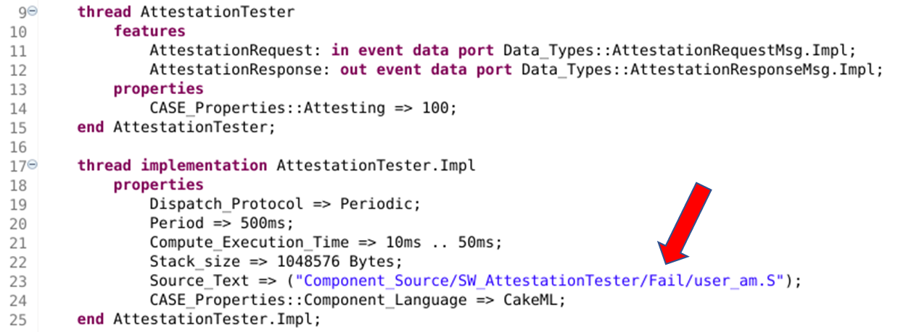

Figure 21. Attestation Tester implementation for producing a failing result.

We will now connect the AttestationTester to the RadioDriver component.  This requires making
modifications to the SW_seL4 system and RadioDriver_Attestation_seL4 process definitions, as well as
the RadioDriver_Attestation thread definition.  Add the following features to the
RadioDriver_Attestation thread (line 168), as shown in Figure 22:

AttestationTesterResponse: in event data port Data_Types::AttestationResponseMsg.Impl;

AttestationTesterRequest: out event data port Data_Types::AttestationRequestMsg.Impl;

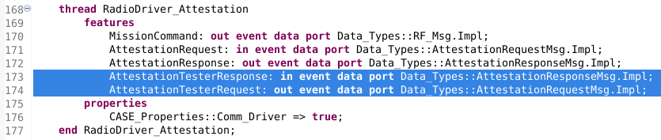

Figure 22. Modified RadioDriver_Attestation thread with ports for communication with the AttestationTester.  Modifications are

in red box.

16

---

## Page 17

Now add the same features to the corresponding RadioDriver_Attestation_seL4 process type (line 188):

AttestationTesterResponse: in event data port Data_Types::AttestationResponseMsg.Impl;

AttestationTesterRequest: out event data port Data_Types::AttestationRequestMsg.Impl;

The new connections between the process and thread components must now be specified in
RadioDriver_Attestation_seL4 process implementation (line 199):

c4: port AttestationTesterResponse -> RadioDriver.AttestationTesterResponse;

c5: port RadioDriver.AttestationTesterRequest -> AttestationTesterRequest;

The RadioDriver_Attestation_seL4 process type and implementation should now appear as shown in
Figure 23.  These modifications add the ports to the RadioDriver component for communicating with the
AttestationTester.

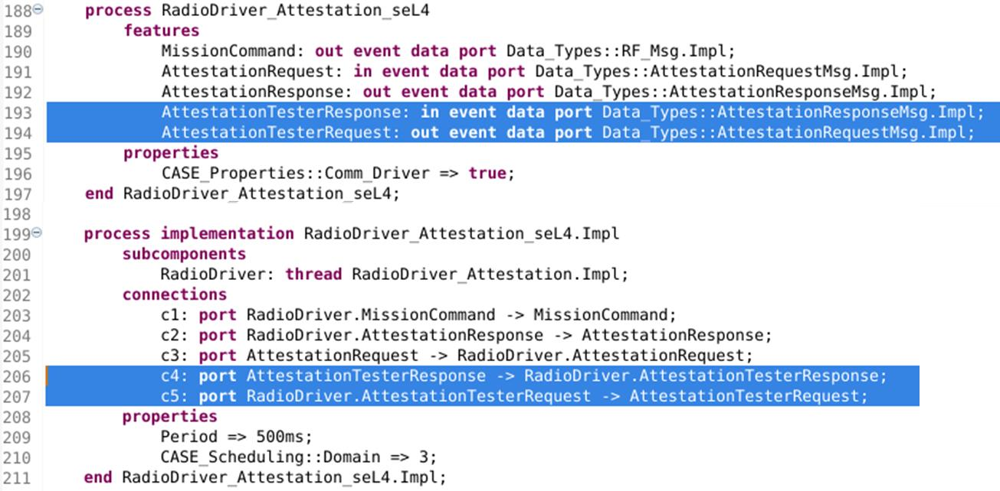

Figure 23. Modified RadioDriver_Attestation_seL4 process with ports and connections for communication with the

AttestationTester.  Modifications are in red boxes.

Finally, add the AttestationTester subcomponent, along with new connections between the RadioDriver
and AttestationTester components by modifying the SW_seL4 system implementation (line 413) to
appear as shown in Figure 24:

AttestationTester: process AttestationTester_seL4.Impl;

c10: port RadioDriver.AttestationTesterRequest -> AttestationTester.AttestationRequest;

c11: port AttestationTester.AttestationResponse -> RadioDriver.AttestationTesterResponse;

17

---

## Page 18

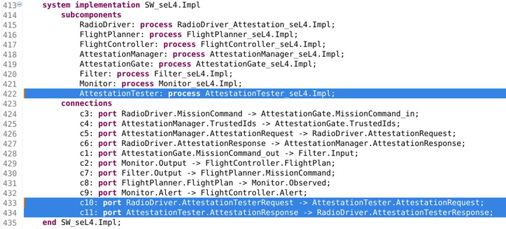

Figure 24. Modified SW_seL4 system with AttestationTester subcomponent and connections.  Modifications are in red boxes.

9.2 Creating a Domain Schedule
The AADL Modeling Guidelines for CASE document included with BriefCASE provides detail on
constructing a domain schedule as well as the AADL property associations necessary for HAMR to
generate the schedule for execution on the seL4 platform.  For this tutorial, we provide the component
scheduling property values necessary for the build to run on the target platform but refer the reader to
the Modeling Guidelines and related HAMR and seL4 documentation for a more comprehensive
understanding of the process.  The domain schedule for this example can be found at /domain-
schedule/schedule.c.

9.3 Checking Model Compliance with Style Guidelines

CHECKPOINT 8 – The Snapshot_8 project corresponds to this section of the tutorial.

Before building the system, it is important to check that the model complies with the style guidelines.
The CASE Modeling Guidelines are included with BriefCASE, and the rules have been formalized as
Resolint statements.  Running Resolint on the model will produce errors or warnings if the model is out
of compliance with any of the guidelines.  To run Resolint, a ruleset needs to be specified.  The HAMR
ruleset is specified in the Resolute annex of the MissionComputer implementation.  To run Resolint on
the example, select MissionComputer.Impl in MC.aadl, then choose BriefCASE → Cyber Assurance →
Resolint → Run Resolint from the menu.  After Resolint runs, an information dialog will display the
number of errors and warnings detected, each of which are listed in the Problems pane at the bottom of
the IDE.  Double-clicking on one of the problems will auto-navigate to the declaration of the AADL
element that is violating the rule.

Once all Resolint problems have been addressed, the model is ready to be built using HAMR.

18

---

## Page 19

10 Building the Cyber-Resilient System
Now we are ready to build the hardened, cyber-resilient version of the example UAV system.  The code
will be compiled for seL4 running on the QEMU emulator.   HAMR can work with both x86 and ARM
architectures.  The hardened system will be built for x86 (emulated in QEMU).

10.1 Compile CakeML components (Attestation Manager & SPLAT components)
One last step in the synthesis of the high-assurance components is building them. We provide a script
that will compile the CakeML components.  Expand the /scripts folder in the AADL Navigator pane and
select the compile-cakeml-source.sh file.  Select Run → External Tools →bash from the menu (see
Figure 25).  Script status messages will print out in the Console pane at the bottom of the workspace.

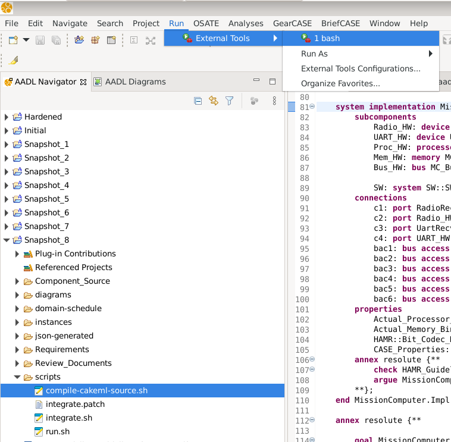

Figure 25. Running scripts from within the BriefCASE environment.

10.2 Building the Hardened System
The first step is to generate the infrastructure code using HAMR.  We run HAMR on the Mission
Computer by selecting MissionComputer.Impl in the Outline pane and selecting BriefCASE → Cyber
Resiliency → Synthesis Tools → HAMR Code Generation from the menu (or by clicking the HAMR button
in the OSATE toolbar).

In the HAMR dialog box that appears, select the platform as seL4 and specify HAMR as the output
directory. Select the seL4/CAmkES output directory to be HAMR /CAmkES. Exclude slang components in
the dialog box and select 64-bit width, as shown in Figure 26, before clicking Run.

19

---

## Page 20

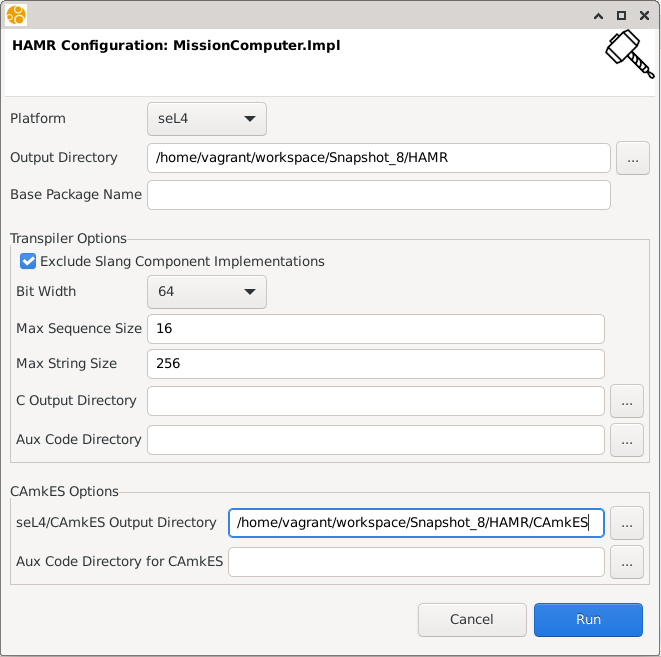

Figure 26.  HAMR configuration dialog for hardened system.

On completion, HAMR’s console output should look similar to:

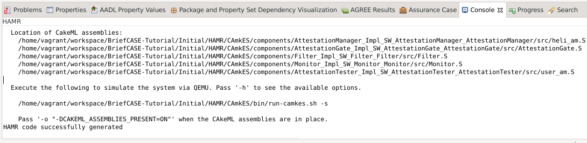

For this example, we provide an integrate.sh script in the project’s /scripts folder that transpiles, moves
the implementation files to their respective locations, and modifies HAMR’s compile scripts to include
the copied files for compilation.  After moving the files to the correct locations, integrate.sh also
compiles them.  We have provided implementations for the RadioDriver, FlightPlanner, and
FlightController, and these components are moved as well.  Note that this is a custom file specific to this
example and is provided to demonstrate the manual steps required for placing source code in the
appropriate directories for the HAMR build.  Without the script, these steps would need to be
performed manually.  This will be automated in future versions of the tool.

The integrate script can be executed by selecting the /scripts/integrate.sh file in the AADL Navigator
pane and clicking Run → External Tools → bash from the menu.

20

---

## Page 21

10.3 Running the Simulation in QEMU

CHECKPOINT 9 – The Hardened project corresponds to this section of the tutorial.

Once compiled, the QEMU emulator can be invoked by selecting /scripts/run.sh and clicking Run →
External Tools → bash from the menu.  This script compiles any changes (if necessary), builds an image,
and loads it into the QEMU environment for simulation.

The simulation running in QEMU outputs messages to the Console pane, as shown in Figure 27:

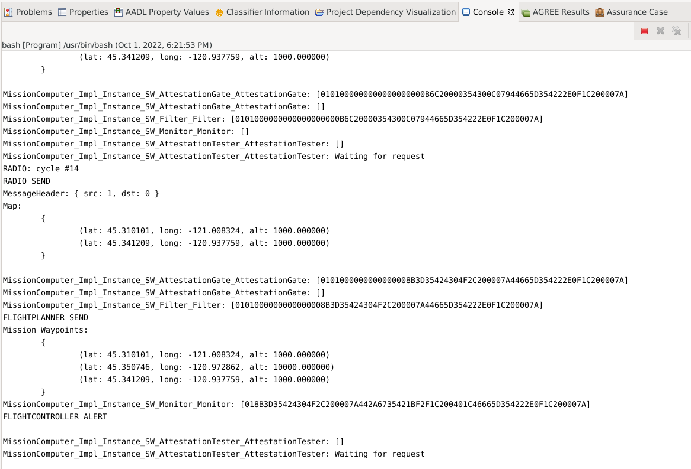

Figure 27. QEMU simulation of the hardened system

To end the QEMU session, click the red square button at the top of the Console.

This is what you should see in the simulation.  The Radio sends out three different messages:

•
The first originates from an untrusted source and is meant to be blocked by the AttestationGate.
•
The second originates from a trusted source, but contains malformed waypoints, and is meant
to be blocked by the filter.
•
The third message should pass both the gate and the filter and reach the FlightPlanner.

The FlightPlanner has been implemented to insert a wayward waypoint into every other set of
waypoints it outputs, starting from the first.  If you have chosen the “Pass” implementation of the
AttestationTester component and the attestation mechanism has done its job, it will send a trusted ID
list to the AttestationGate (we are expecting that ID to be “1”).

We expect the Radio’s first and fourth messages to be blocked by the gate; the second and fifth
messages to be blocked by the filter; the third message to be blocked by the monitor; and the sixth

21

---

## Page 22

message to be received by the FlightController (along with the legitimate waypoint inserted by the
FlightPlanner). This pattern should repeat forever.

If you instead choose the “Fail” implementation of the AttestationTester, the trusted ID list will remain
empty, and all messages will be blocked by the AttestationGate.

22

